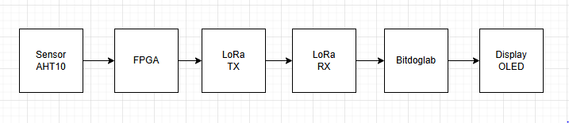

## Transmissão de Dados via LoRa — FPGA ColorLight i9 e BitDogLab

Este projeto implementa um sistema de comunicação sem fio entre um SoC customizado rodando em uma FPGA ColorLight i9 e uma BitDogLab, utilizando módulos LoRa RFM96.

O sistema tem como objetivo coletar dados ambientais (temperatura e umidade) por meio de um sensor AHT10 via I2C e transmiti-los periodicamente pelo módulo LoRa via SPI.  
A BitDogLab atua como nó receptor, recebendo os dados e exibindo-os em um display OLED.

### Estrutura do Sistema

#### FPGA (ColorLight i9)
- **SoC customizado com LiteX**, baseado no *target* `colorlight_i5`.
- **Core:** VexRiscv.
- **Periféricos incluídos:**
  - **SPI** – interface com o módulo **LoRa RFM96**.  
  - **I2C** – interface com o sensor **AHT10**.  
- **Funcionalidade:**  
  - Inicializa periféricos SPI e I2C.    
  - Envia os dados formatados via LoRa após rodar o comando send.

#### BitDogLab
- **Módulo LoRa** conectado ao via spi central da placa.
- **Display OLED** conectado via I2C.
- **Firmware em C** responsável por:
  - Receber os pacotes LoRa enviados pela FPGA.
  - Decodificar os dados (temperatura e umidade).
  - Atualizar as leituras no OLED.

### Diagrama de Blocos do Sistema:



### Fluxo de build e copilação (exemplo para Linux)

# AVISO! CONECTAR O LoRa NO CN2 E SENSOR AHT10 NO J1 DO FPGA

1. Fazer a clonagem do repositório e entrar na pasta

```powershell
git clone https://github.com/heribertomonteiro/transmissao-de-dados-via-LoRa.git
```

2. Entrar na pasta do FPGA
```powershell
cd transmissao-de-dados-via-LoRa
cd fpga
```

3. Instalar o openFPGALoader:

```powershell
apt install openfpgaloader
```

4. Entrar no ambiente de desenvolvimento OSS-CAD-SUITE

```powershell
source ~/../oss-cad-suite/environment
```

5. Gerar/compilar o SoC e o bitstream (diretório raiz do projeto):

```powershell
python3 litex/colorlight_i5.py --board i9 --revision 7.2 --build --cpu-type=picorv32 --ecppack-compress
```

6. Programar a FPGA com o bitstream de configuração:

```powershell
sudo openFPGALoader -b colorlight-i5 build/colorlight_i5/gateware/colorlight_i5.bit
```

7. Gerar `csr.h` (pelo build do LiteX) e compilar firmware (gera `main.bin`):

```powershell
cd firmware
make
```

8. Conectar via terminal serial (litex_term) e carregar o kernel (`main.bin`):

```powershell
sudo ~/../oss-cad-suite/bin/litex_term /dev/ttyACM0 --kernel main.bin
```

9. Se depois de rodar o comando acima e não aperecer nada, aperta ENTER e após aparecer **litex>** ou **RUNTIME>** é preciso digitar **reboot** e apertar enter.


## Link do video mostrando o funcionamento:
[https://youtu.be/jLZwzpORT84?si=TMalt9ynCjvAYpzH](https://youtu.be/jLZwzpORT84?si=TMalt9ynCjvAYpzH)
